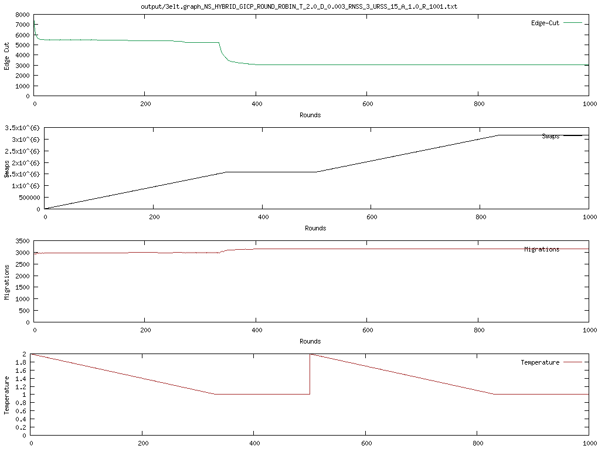
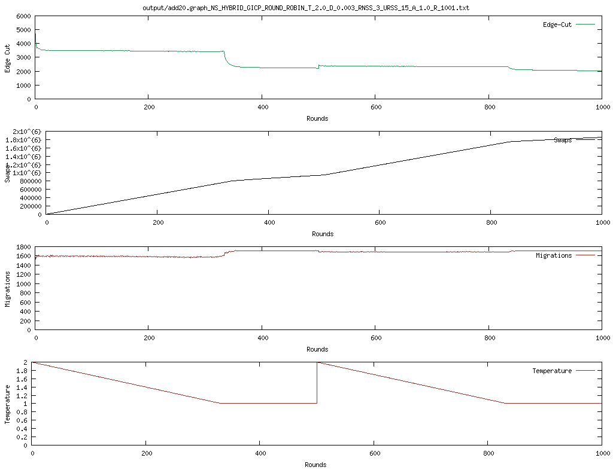
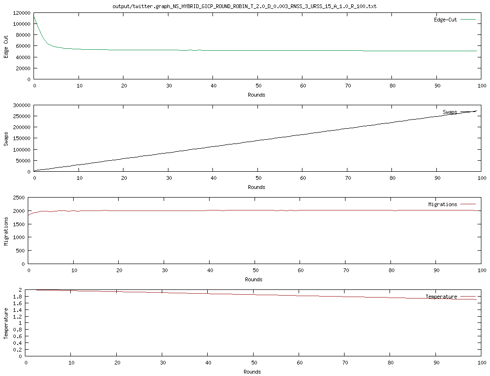
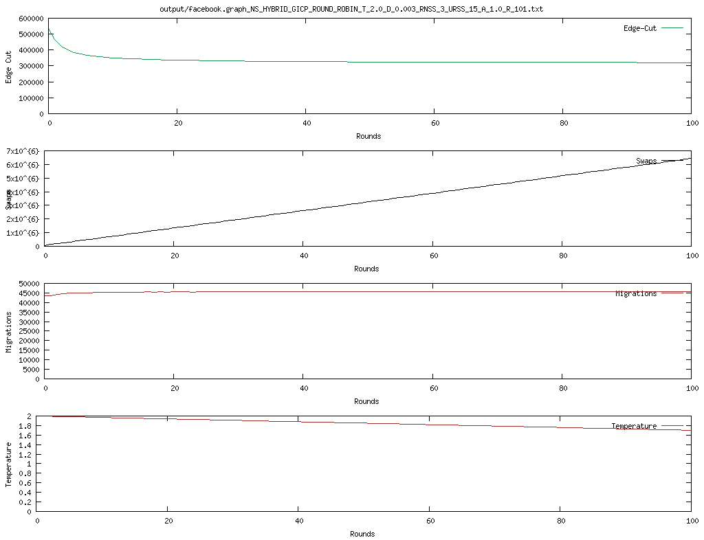

# Homework 5
December 8

### Authors
Bernard Rumar -- [bernardr@kth.se](mailto:bernardr@kth.se)

Vivienne Curewitz -- [curewitz@kth.se](mailto:curewitz@kth.se)

## Datasets used
- 3elt
- add20

## Solution
For the main part of the graph partitioning, `sampleAndSwap` takes a node and swaps the color with another node. It selects a sample of nodes based on a selection policy: neighbors or random sample. It then gives the sample to the function `findPartner` which selects the node with the highest utility to swap colors with. Depending on the selection policy, the candidate node will either be selected from the neighbors or a random sample set. The problem with this is that it may achieve a local maximum which may hinder it from finding a better solution. That's why task 2 adds annealing to possibly select a node with worse utility which may avoid falling into a local maximum.

```java
private void sampleAndSwap(int nodeId) {
    Node partner = null;
    Node nodep = entireGraph.get(nodeId);
    Node plocal = null;
    Node prandom = null;

    if (config.getNodeSelectionPolicy() == NodeSelectionPolicy.HYBRID
            || config.getNodeSelectionPolicy() == NodeSelectionPolicy.LOCAL) {
        // swap with random neighbors
        partner = findPartner(nodeId, nodep.getNeighbours().toArray(new Integer[0]));
        plocal = partner;
    }
    if ((config.getNodeSelectionPolicy() == NodeSelectionPolicy.HYBRID && partner == null)
            || config.getNodeSelectionPolicy() == NodeSelectionPolicy.RANDOM) {
        // if local policy fails then randomly sample the entire graph
        config.setUniformRandSampleSize(15); // arbitrary value
        Integer[] nodeSamples = getSample(nodeId);
        partner = findPartner(nodeId, nodeSamples);
        prandom = partner;
    }

    // swap the colors
    if (partner != null) {
        int pColor = nodep.getColor();
        nodep.setColor(partner.getColor());
        partner.setColor(pColor);
        numberOfSwaps++;
    }
}
```

```java
public Node findPartner(int nodeId, Integer[] nodes){

    Node nodep = entireGraph.get(nodeId);

    Node bestPartner = null;
    double highestUtil = 0;

    for (int qId : nodes) {
        Node nodeq = entireGraph.get(qId);

        int degpp = (int) nodep.getNeighbours().stream().filter(n -> entireGraph.get(n).getColor() == nodep.getColor()).count();
        int degqq = (int) nodeq.getNeighbours().stream().filter(n -> entireGraph.get(n).getColor() == nodeq.getColor()).count();

        int degpq = (int) nodep.getNeighbours().stream().filter(n -> entireGraph.get(n).getColor() == nodeq.getColor()).count();
        int degqp = (int) nodeq.getNeighbours().stream().filter(n -> entireGraph.get(n).getColor() == nodep.getColor()).count();
        
        assert(config.getAnnealingPolicy().equals("default") || config.getAnnealingPolicy().equals("exp"));
        if (config.getAnnealingPolicy().equals("default")) {
            double util = (Math.pow(degpq, this.alpha) + Math.pow(degqp, this.alpha)) * this.T - (Math.pow(degpp, this.alpha) + Math.pow(degqq, this.alpha));
            if (util > highestUtil) {
                bestPartner = nodeq;
                highestUtil = util; 
            }
        } else if (config.getAnnealingPolicy().equals("exp")) {
            // no multiply by T here
            double next_util = Math.pow(degpq, this.alpha) + Math.pow(degqp, this.alpha);
            double current_util = Math.pow(degpp, this.alpha) + Math.pow(degqq, this.alpha);
            if (acceptanceProbabilty(Math.max(current_util, highestUtil), next_util)) {
                bestPartner = nodeq;
                highestUtil = next_util;
            }
        }
    }
    return bestPartner;
}
```

### Task 2
For task 2, we had to compare different annealing techniques. We vary both the acceptanceProbability (will a node swap) and the Temperature descent rate:
```java
private boolean acceptanceProbabilty(double old_util, double new_util) {
    double delta_ratio = (new_util - old_util)/this.T;
    double acceptance_probability = Math.exp(delta_ratio);
    return Math.random() < acceptance_probability;
  }
```
```java
private void saCoolDown(){
    if (config.getTempPolicy().equals("default")) {
      if (T > 1)
        T = T - this.delta;
      if (T < 1)
        T = 1;
    } else if (config.getTempPolicy().equals("log")) {
      T = T * (1 - this.delta); // approaches 0
    }
    
  }
```
So, with new ways to determine acceptance, we can compare to the Task 1 implementation:
**Default -- Task 1**

**With Exp Acceptance Probability**

**With "Power Law" Cooldown"**


We don't see a lot of difference between the behaviors here. 

This task also asked us to consider resetting the temperature from time to time - it suggests waiting until well after the algo has stabilized - so we reset every 500 steps, and test again with 3elt.
**Default With Cooldown Reset **

**With Exp Acceptance Probability**

**With "Power Law" Cooldown"**


This shows us something really interesting - the default function to determining when to swap easily gets stuck. Because the exp function is probability based, it can always swap sometimes. We also see across both sets of results that the slower inverse exponential cooldown seems to behave worse than the linear cooldown. I believe this is because more bad swaps are made and as a result it takes longer to "anneal".

### Bonus Task
We are tasked with improving the algorithm. After some testing, I couldn't find a better annealing function than the second one. Also, we know that a linear cooldown is better than a slower inverse exponential one. The first improvement is just to automatically reset the temperature when the algo freezes. This means we can more rapidly iterate:
```java
  private void adjustTemp() {
    if (T > 1) {
      return;
    }
    if (getEdgeDerivative() < 1.0) {
      T = config.getTemperature();
      logger.info("\n\nTemperature Reset: " + round + "\n\n");
    }
  }

  private void updateEdgeDerivative(Integer edge_cut) {
    if (derivative.size() == dSize) {
      derivative.removeFirst();
    }
    derivative.addLast(edge_cut);
  }

  private double getEdgeDerivative() {
    if (derivative.size() < 2) {
      return 10000.0; // anything big is fine
    }
    return (derivative.getLast() - derivative.getFirst())/dSize;
  }
```
And we can view the results:
**With Exp Acceptance Probability**

**With "Power Law" Cooldown"**


We can see that compared to the fixed interval temperature reset, this gets to a lower edgecut - about 800 edges less than the fixed interval at 5000 rounds. I experimented with different values and buffer sizes, but this seemed to be the best.

However, in all of these tests we are using the default num_partitions=4. But what if there aren't 4 clusters? Let's look at 3elt again:
**Exp 5p with 2 Partitions**


We have a better edge cut at 2 partitions than 4 - so maybe there are two clusters? We would expect cutting through a cluster imparts a high edge cost, but it is hard to say with these values.
We can look at the fiedler:
**3elt Feidler Vector**


And that is a mess, so it is going to be very difficult to use the fielder vector to automatically select number of clusters.

## Results
**3elt graph**


**add20 graph**


**Twitter graph**


**Facebook graph**


## Benchmarks
Running the program through the IntelliJ Profiler gives the following results:

|   Graph  | CPU Time (ms) |
|----------|---------------|
| 3elt     |      3,200    |
| add20    |      3,200    |
| twitter  |    247,400*   |
| facebook |    217,900*   |

**Parameters**
- rounds: 1,000
- temp: 2
- alpha: 1
- delta: 0.003

\*Extrapolation based on 100 rounds